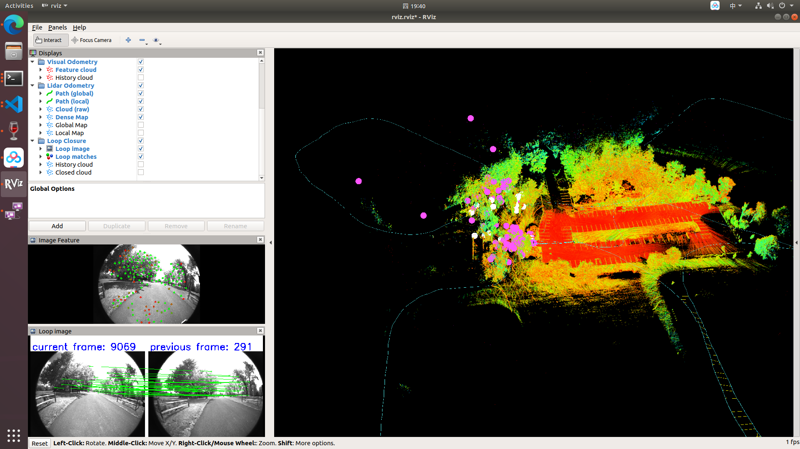

## LVI-SAM 原仓库链接
https://github.com/TixiaoShan/LVI-SAM

## 数据集下载
LVI-SAM原作者录制的handheld.bag

链接: https://pan.baidu.com/s/1yJeSZ_GVj1tTejG4KbNH5Q 提取码: iw9x 

## 运行
先运行launch file，再在rosbag目录下运行rosbag提供数据：
```
roslaunch lvi_sam run.launch
rosbag play handheld-002.bag # 在rosbag目录下运行
```


